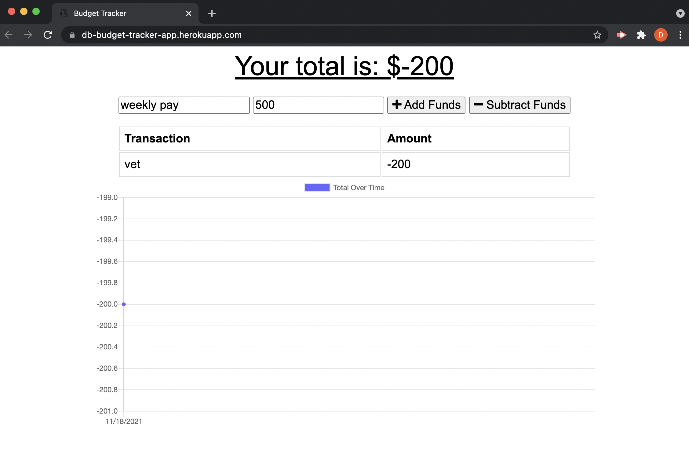

# Budget Tracker 

## Description
A budget tracking app that lets you interact on and offline to keep track of your expenses.

## Table of Contents
- [Budget Tracker]
  - [Description](#description)
  - [Table of Contents](#table-of-contents)
  - [Installation](#installation)
  - [Usage](#usage)
  - [Contributing](#contributing)
  - [License](#license)
  - [Questions](#questions)

## Installation
Visit the app [here!](https://db-budget-tracker-app.herokuapp.com/)

## Usage
### Screenshots (Desktop and Mobile)

## Contributing
To contribute, contact me below!

## License
This application is covered under the MIT License

## Links
[Repository](https://github.com/deannaboiani/budget-tracker)  

## Questions
If you have any questions, please visit my Github profile or email me using the links below

[Github](https://github.com/deannaboiani)  
[Email](mailto:deannaboiani@gmail.com)